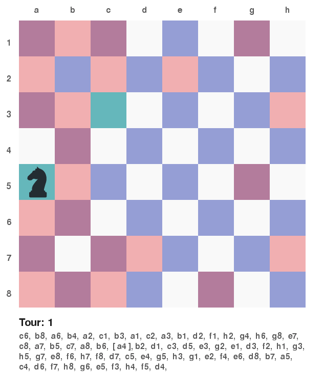

# Knights Tour

Info about the Knights Tour problem as described by wikipedia:

A knight's tour is a sequence of moves of a knight on a chessboard such that 
the knight visits every square only once. If the knight ends on a square that 
is one knight's move from the beginning square (so that it could tour the board 
again immediately, following the same path), the tour is closed, otherwise it 
is open.

For more info: https://en.wikipedia.org/wiki/Knight%27s_tour


## Running

The main programs use python to run. or if you want to try the C implementation, a C compliler.

### Running Python files.

To simply return a tour of a given size in the form of a list, you can run the `knightsTour.py` file with command line arguments to specify the size of the board and start position.

```bash
$ python knightsTour.py <boardsize> <start X> <start Y> 
```
eg:

```bash
$ python knightsTour.py 24 8 6
```

If no arguments are specified the board will default to a 8x8 size and start at the co-oridnates (0,0)

To run the GUI Visualser `pygame` is required. The command arguments are slightly different here. This is as follows.
```bash
$ python guiVisualiser.py <algebraic position notation> <size>
```
eg:
```bash
$ python guiVisualiser.py a4 8
```

Here if no arguments are specified the board will default again to a 8x8 size and at position `a1`.
Because of the design of the interface the board will not render a board bigger than 9x9. This should be fixed in the future. 



In the gui visualiser once the program has completed its first tour it will start again from its finishing position.

In both cases if you specify a position that is outside the range of the board you will get an assertion error.


## About this Implementation

For more info about the implementation, see analysis in the [jupyter notebook](https://github.com/winstonjay/knightsTour/blob/master/analysis.ipynb). Its a bit of a mess right now and probally isnt up to date.